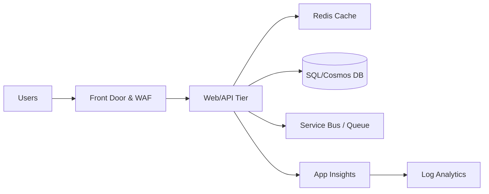

## Overview
This project demonstrates how to design, automate, and observe a scalable cloud landing zone using **Azure + GitHub Actions + Bicep**.

It began as part of the **Black Friday Architecture Challenge**, simulating a production-grade e-commerce environment expecting:
- 500,000+ users in 24 hours  
- 10× spike in checkout requests  
- Real-time inventory updates  
- Flash sales and personalized offers  

The current deployment runs in a **constrained lab subscription**, focusing on core observability and CI/CD automation.

---
## High-Level Architecture (Target)

---

## Skills Demonstrated

- **Cloud Architecture (Azure)** – Resource groups, environments, observability, production-ready modules.
- **Infrastructure as Code** – Bicep modules for network, App Service, monitoring, and alerts.
- **CI/CD** – GitHub Actions deploying infra into Azure using a service principal.
- **Operational Readiness** – Runbooks, load test plan, and alerting skeleton.
- **Application Design** – Sample Node.js API aligned to the Black Friday scenario.

---

## Sample Application

The repo includes a minimal **Node.js / Express API** (`app/api`) that would represent the
e-commerce backend for this architecture:

- `GET /health` – health probe for uptime checks.
- `GET /products` – returns a product catalog.
- `POST /checkout` – accepts a checkout request and returns a order id.

In a production subscription, this API would run on **Azure App Service** or **AKS**
behind **Azure Front Door + WAF**, with telemetry streamed to Application Insights and
Log Analytics as defined in the infra modules.

---

## Current State (Deployed via GitHub Actions)
**Environment:** `staging`  
**Resource Group:** `rg-bf-staging`  
**Region:** `East US`  
**Pipeline:** `.github/workflows/deploy-staging.yml`

### Resources Deployed
| Resource | Type | Purpose |
|-----------|------|---------|
| `log-bf-staging` | Log Analytics Workspace | Centralized telemetry and metric storage |
| `appi-bf-staging` | Application Insights | End-to-end application monitoring |

The entire environment is defined in `infra/main.bicep` and deployed automatically using GitHub Actions.

---

## CI/CD Workflow Summary

**Trigger:** On `push` to `main`  
**Actions:**
1. Checkout repository  
2. Log in to Azure using service principal  
3. Deploy `infra/main.bicep`  
4. Validate deployment output

**Secrets Used:**
- `AZURE_CREDENTIALS`
- `AZURE_SUBSCRIPTION_ID`
- `AZURE_RESOURCE_GROUP_STAGING`
- `AZURE_REGION`

---
## Architecture Roadmap

The **full-scale architecture** (for production or enterprise subscription) includes:

| Layer | Azure Service | Purpose |
|-------|----------------|---------|
| **Networking & Security** | VNet, NSGs, Azure Firewall | Segmented subnets for frontend, backend, and data tiers |
| **Global Entry Point** | Azure Front Door + WAF | Global routing, DDoS protection, SSL offload |
| **Compute Tier** | Azure App Service / AKS | Scalable web + API hosting |
| **Data Tier** | Azure SQL / Cosmos DB | Persistent product, order, and user data |
| **Caching & Messaging** | Azure Redis Cache / Service Bus | Speed + decoupled order processing |
| **Observability** | Log Analytics + App Insights + Workbooks | Metrics, traces, live dashboards |
| **Automation** | GitHub Actions + Bicep | Continuous deployment and drift correction |

---

## Operations & Runbooks
Once Application Insights is live, you can:
- View live metrics in Azure Portal  
- Connect Log Analytics to dashboards and KQL queries  
- Add a `Workbook` for traffic, latency, and error insights

---

## Roadmap
- [ ] Add App Service Plan (F1 or higher) for API/Web layer  
- [ ] Add Azure Front Door (WAF-enabled)  
- [ ] Configure alert rules and runbooks for incident response  
- [ ] Expand CI/CD to production environment (`rg-bf-prod`)  
- [ ] Add cost management and tagging policies  

---

## Author
**Malcolm Warren**  
Future Cloud Architect | Azure & DevOps | Cloud Advocate

Norfolk State University | ☁️ AZ-900/305 (In Progress)
